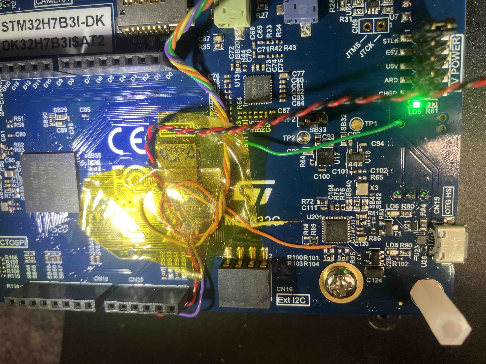
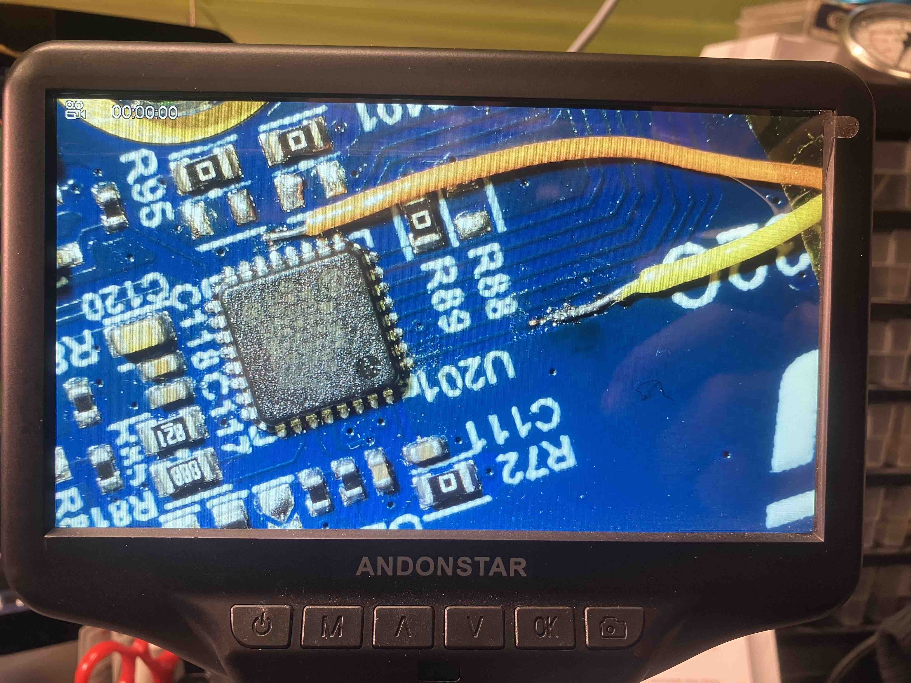
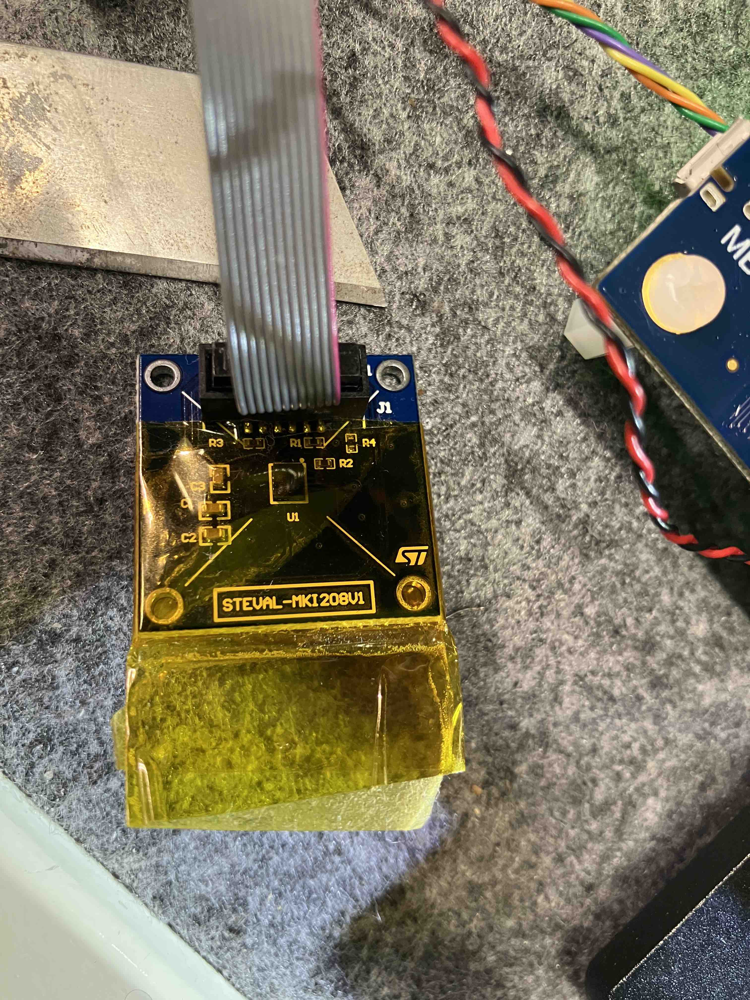
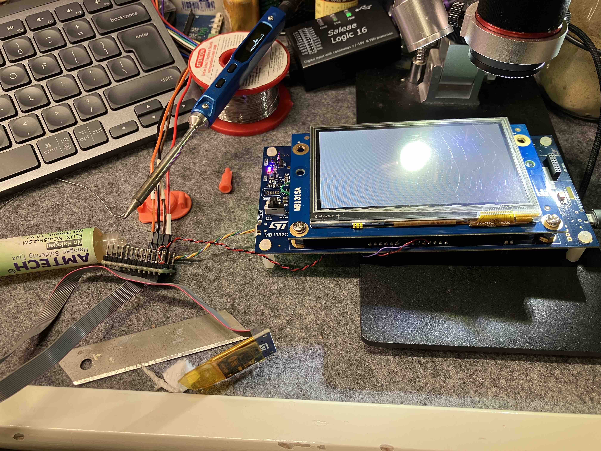
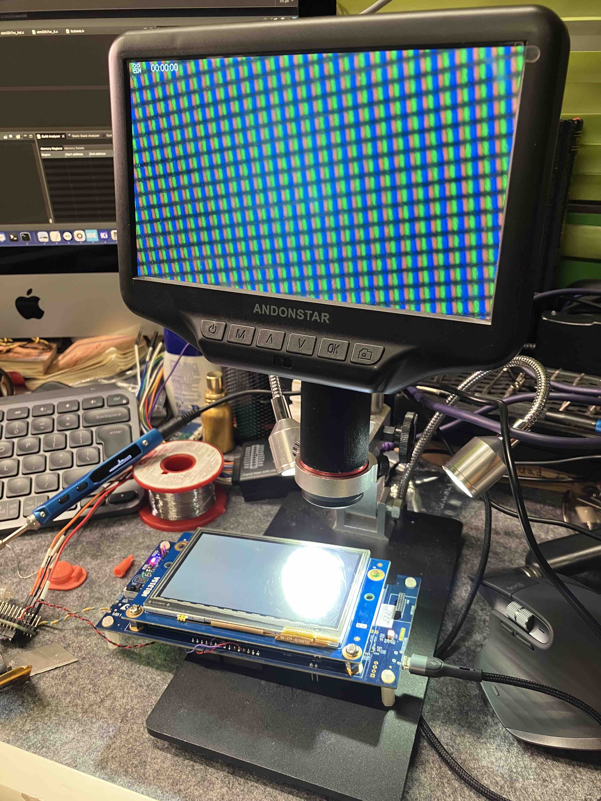
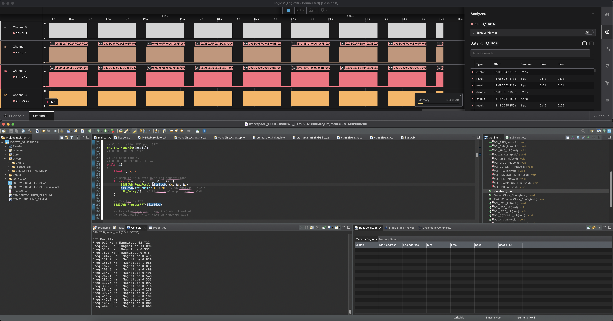
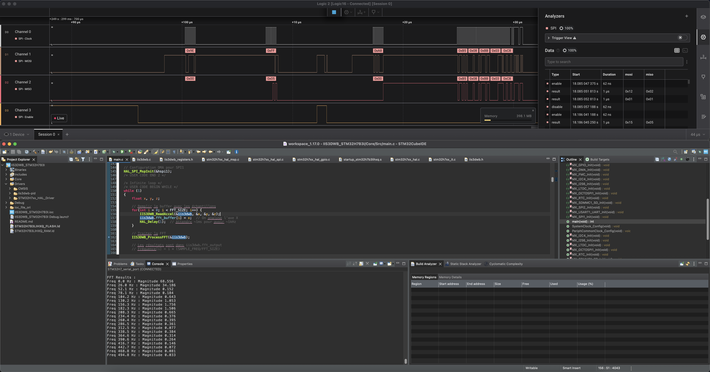

# IIS3DWB_STM32H7B3I-DK

# Vibration Analysis with IIS3DWB and STM32H7B3I-DK

Real-time vibration analysis system using the IIS3DWB high-performance accelerometer and STM32H7B3I-DK development board. This project implements Fast Fourier Transform (FFT) for frequency domain analysis of vibration data.

## Features

- High-speed data acquisition (26.667 kHz sampling rate)
- Real-time FFT processing using ARM CMSIS-DSP
- DMA-optimized SPI communication
- Configurable frequency analysis parameters
- Hardware platform: STM32H7B3I-DK development board
- Sensor: IIS3DWB MEMS accelerometer

## Project pictures

| *Back view*               | *MOSI & SCK connections*  |
|:-------------------------:|:-------------------------:|
|  |  |

--------------------------------------------------------

| *IIS3DWB accelerometer*   | *STM32H7B3I-DK Dev Kit*  |
|:-------------------------:|:-------------------------:|
|  |  |

--------------------------------------------------------

| *Imporovised workspace*   | *SPI transactions overview with a logic analyzer (click to enlarge)*  |
|:-------------------------:|:-------------------------:|
|  |  |

| *Detailed SPI transactions with a logic analyzer & serial output of FFT analysis results (click to enlarge)*  |
|:-------------------------:|
|  |

## Hardware Setup

### Required Components
- STM32H7B3I-DK development board
- IIS3DWB accelerometer module
- Connecting wires

### Connections
| IIS3DWB Pin | STM32H7B3I-DK Pin | GPIO Pin |
|-------------|-------------------|----------|
| SCK         | SPI1_SCK          | `PA5`    |
| MOSI        | SPI1_MOSI         | `PB5`    |
| MISO        | SPI1_MISO         | `PB4`    |
| CS          | IIS3DWB_CS        | `PA4`    |
| VDD         | 3.3V              | `3.3v`   |
| GND         | GND               | `GND`    |

## Software Requirements

- STM32CubeIDE 1.13.0 or later
- CMSIS-DSP library
- STM32H7 HAL drivers

## Project Configuration

### SPI Configuration
- Mode: Full-Duplex Master
- Data Size: 8 bits
- First Bit: MSB First
- Prescaler: 8 (8 MBits/s)
- SPI Mode : 0 (it could also be 3)
  - Clock Polarity (CPOL): Low
  - Clock Phase (CPHA): 1 Edge

### DMA Settings (not yet implemented)
- SPI1_TX: DMA1 Stream 0
- SPI1_RX: DMA1 Stream 1
- Priority: High
- Data Width: Byte
- Memory Increment: Enabled

## Data Processing

The project implements the following processing chain:
1. High-speed data acquisition from IIS3DWB
2. DMA transfer to memory (to do)
3. Hanning window application
4. Real FFT computation
5. Magnitude calculation

FFT results provide frequency content analysis from 0 to 13.3 kHz (Nyquist frequency).

## Acknowledgments

- STMicroelectronics for their excellent development tools
- ARM for the CMSIS-DSP library
- All contributors to this project
